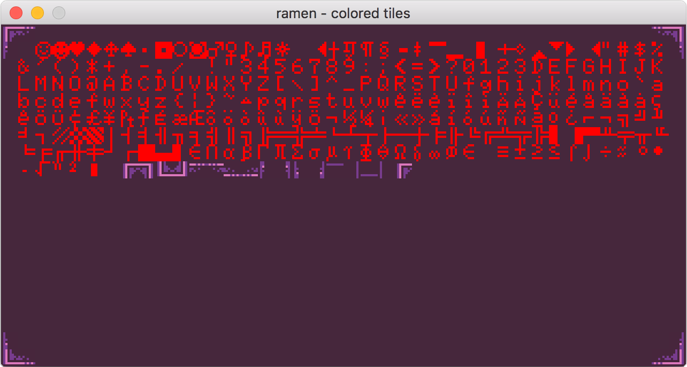
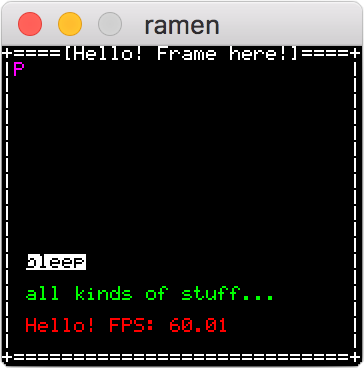
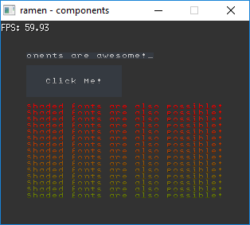

[](http://godoc.org/github.com/BigJk/ramen/console) [](https://goreportcard.com/report/github.com/BigJk/ramen) [](LICENSE)

**ramen** is a simple console emulator written in go that can be used to create various ascii / text (roguelike) games. It's based on the great **[ebiten](https://github.com/hajimehoshi/ebiten)** library and inspired by libraries like **[libtcod](https://bitbucket.org/libtcod/libtcod/wiki/Features)**.

**Warning:** This is still a early version so api and features are not fixed yet. Bugs will happen!

<br>

## Features

- PNG Fonts with more than 256 chars possible
- Fonts can contain chars and colored tiles
- Create sub-consoles to organize rendering
- Component based ui system
- Pre-build components ready to use
  - TextBox
  - Button
- REXPaint file parsing
- Everything **ebiten** can do
  - Input: Mouse, Keyboard, Gamepads, Touches
  - Audio: MP3, Ogg/Vorbis, WAV, PCM
  - ...

## Get Started

```
go get github.com/BigJk/ramen/...
```

## Example

```go
package main

import (
	"github.com/BigJk/ramen/console"
	"github.com/BigJk/ramen/consolecolor"
	"github.com/BigJk/ramen/font"
	"github.com/BigJk/ramen/t"
	"github.com/hajimehoshi/ebiten"
	"fmt"
)

func main() {
	// load a font you like
	font, err := font.New("../../fonts/terminus-11x11.png", 11, 11)
	if err != nil {
		panic(err)
	}

	// create a 50x30 cells console with the title 'ramen example'
	con, err := console.New(50, 30, font, "ramen example")
	if err != nil {
		panic(err)
	}

	// set a tick hook. This function will be executed
	// each tick (60 ticks per second by default) even
	// when the fps is lower than 60fps. This is a good
	// place for your game logic.
	//
	// The timeDelta parameter is the elapsed time in seconds
	// since the last tick.
	con.SetTickHook(func(timeElapsed float64) error {
		// your game logic
		return nil
	})

	// set a pre-render hook. This function will be executed
	// each frame before the drawing happens. This is a good
	// place to draw onto the console, because it only executes
	// if a draw is really about to happen.
	//
	// The timeDelta parameter is the elapsed time in seconds
	// since the last frame.
	con.SetPreRenderHook(func(screen *ebiten.Image, timeDelta float64) error {
		con.ClearAll(t.Background(consolecolor.New(50, 50, 50)))
		con.Print(2, 2, "Hello!\nTEST\n Line 3", t.Foreground(consolecolor.New(0, 255, 0)), t.Background(consolecolor.New(255, 0, 0)))
		con.Print(2, 7, fmt.Sprintf("TPS: %0.2f\nFPS: %0.2f\nElapsed: %0.4f", ebiten.CurrentFPS(), ebiten.CurrentFPS(), timeDelta))
		return nil
	})

	// start the console with a scaling of 1
	con.Start(1)
}

```

## Screenshots




