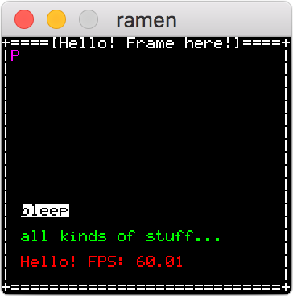

[](http://godoc.org/github.com/BigJk/ramen) [](https://goreportcard.com/report/github.com/BigJk/ramen) [](LICENSE)

**ramen** is a simple console emulator written in go that can be used to create various ascii / text (roguelike) games. It's based on the great **[ebiten](https://github.com/hajimehoshi/ebiten)** library and inspired by libraries like **[libtcod](https://bitbucket.org/libtcod/libtcod/wiki/Features)**.

**Warning:** This is still a early version so api and features are not fixed yet

<br>

## Get Started

```
go get github.com/BigJk/ramen
```

## Example

```go
package main

import (
	"time"

	"github.com/BigJk/ramen"
	"github.com/hajimehoshi/ebiten"
)

func main() {
  // load a font you like
  font, err := ramen.NewFont("./your-8x8-font.png", 8, 8)
  if err != nil {
    panic(err)
  }

  // create a 50x30 cells console with the title 'ramen example'
  con, err := ramen.NewConsole(50, 30, font, "ramen example")
  if err != nil {
    panic(err)
  }

  // set a pre-render hook. This function will be executed
  // each frame before the drawing happened. You can also
  // call the console functions from other goroutines.
  // The timeDelta parameter is the elapsed time in seconds
  // since the last frame.
  con.SetPreRenderHook(func(screen *ebiten.Image, timeDelta float64) error {
    con.ClearAll()
    con.PrintFrameEx(0, 0, con.Width, con.Height, ramen.DefaultFrame, "Hello! Frame here!")
    con.PrintEx(2, con.Height-7, "bleep", ramen.NewColor(0, 0, 0), ramen.NewColor(255, 255, 255))
    con.Print(2, con.Height-5, "all kinds of stuff...", ramen.NewColor(0, 255, 0))
    con.PrintFmt(2, con.Height-3, "Hello! FPS: %0.2f", ramen.NewColor(255, 0, 0), ebiten.CurrentFPS())
    return nil
  })

  // start the console with a scaling of 1
  con.Start(1)
}
```

## Screenshots


<p align="center">
  
</p>

<p align="center">
  
</p>
